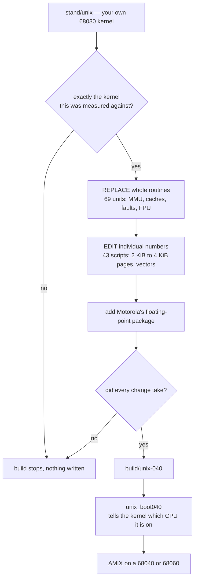

<p align="center">
  
</p>

# AMIX 68040/68060 Port
2500
Amiga UNIX — Commodore's 1991 System V Release 4 for the Amiga 2500UX/3000UX originally runs
only on a 68030. This project makes it run on a **68040** and a **68060**, from a single image,
and it does so by patching the stock kernel binary rather than by rebuilding it from
sources...which nobody has?

You supply your own licensed AMIX 2.1c installation. Nothing here is redistributable
Commodore or AT&T material, and kernel binary is available here.


```
   your AMIX install          this repository          what you boot
  ┌────────────────────┐    ┌───────────────┐    ┌────────────────────┐
  │  stand/unix        │───▶│ relink-040.sh │───▶│  unix-040          │
  │  68030 kernel      │    └───────────────┘    │  boots 040 and 060 │
  └────────────────────┘                         └────────────────────┘
      left untouched
```

Your AMIX partition is never written to. If anything goes wrong, boot the machine with a 68030
and it starts the original system from the boot partition as before.


## Forewords and disclaimer

This Project is a hobbyist work on a 34-year-old proprietary operating system. The
motivation for this work is born purely out of curiosity on using modern AI tools and
curiosity to an old, obscure and dead operating system. This project is meant to be fun 
and nothing serious. So please do not take this too seriously.

This work is not affiliated with Commodore, AT&T, Hyperion or anyone else. Not supported.
Not for production use — this is a technical exercise and a preservation project, so
please.... have fun!


For more concrete user related info, visit the [EAB forum thread](https://eab.abime.net/showthread.php?t=123245).

## What works

One kernel image boots both processors. Everything below has been done on a real Amiga 3000,
unless it says otherwise.

* **Boots to login** on a 68040 and on a 68060, and in Amiberry
* **Caches on** — instruction cache and data cache, in copyback mode, by default
* **X11R5 on real RTG hardware**, with two different cards and drivers: Xsvga on a Piccolo, and
  the Xrtg server on a Zorro II VA2000. The twm desktop works
* **Console and telnet login**, A2065 ethernet
* **SCSI root filesystem**, init/rc, fsck, reboot, shutdown
* **NFS client**, read and write
* **Floating point is correct** — Motorola's FPSP for the 68040, and the full 68060 package
* **68060 64-bit integer instructions** the CPU does not implement are emulated
* **Nethack runs.** So does the native C compiler
* A memory leak that used to force a reboot every few hours is fixed

### What works less well

* Long-term stability is better than it was, but unproven
* Two ways to crash it are known and captured, but not explained (`ISSUE-9`, `ISSUE-10`)
* `shutdown -i0` crashes on the halt path — the system survives it, and `reboot` works
* `init 6` hangs, but that one turned out to be userland (`rc6`), not the kernel
* The s5 filesystem is untested and probably does not work
* Booting needs the patched `unix_boot040` loader; the native boot-partition path is still
  68030-only
* Zorro III is not available yet — see below
* 68LC060 has never been tried

Every claim above has an acceptance document in `docs/` naming the build, the test and the
numbers. Where a code path has never been exercised, it is listed as such rather than assumed
correct.

### Next

* Zorro III RTG cards
* The halt path, and the rc6 reboot sequence
* Reconstructing the kernel sources from the SVR4 3B2 tree — maybe

## Two things people ask about

### "AMIX can only see 16 MB"

It cannot see only 16 MB, and there is no 16 MB limit anywhere in the kernel. The story has a
real root, though, and it is worth knowing which part is true.

On an **A3640** the accelerator has no RAM of its own, so the kernel runs from the A3000
motherboard's fast RAM — and that tops out at 16 MB. On that card the machine really does have
about 16 MB of usable memory. It is a property of the card, not of Amiga UNIX. Put the same
kernel on an accelerator with its own RAM and it uses that instead.

What *is* a real limitation, and was measured here: this machine offers **48 MB in two separate
regions** — 32 MB at `0x08000000` and another 16 MB at `0x07000000`, the second one *below* the
first — and AMIX counts only the region the kernel happened to be loaded into. So you can lose
16 MB to the arrangement of your memory rather than to any ceiling.

We went looking for the ceiling and did not find one. The blocker is that the boot-time algorithm
does not recognise two separate regions as one pool; teaching it to is bounded work, not a
counter that needs widening. It was analysed and then **deliberately not done** — the machines
this port serves do not need it enough to justify touching the startup path.

### Zorro III

Not supported, and this is the next thing to be attempted.

The reason is specific rather than vague: a Zorro III card's memory window lives at `0x40000000`,
and on this kernel a driver cannot reach it. The transparent translation register that makes
physical memory directly addressable covers only the first gigabyte, and `0x40000000` is inside a
kernel segment that faults on access instead.

It is worth doing because the Zorro II ceiling is real and measured. On 2026-08-10 the Zorro II
graphics aperture sustained **3.09 MB/s against 28.66 MB/s** for local memory, and a width test
showed the bus is **saturated rather than serialised** — meaning a wider path would actually help,
which is exactly what Zorro III is.

The plan, in order: fix the VA2000 driver's addressing, test it in Zorro II mode first, then the
framebuffer mapping class, then the card firmware.

## Where it runs

**Real hardware.** An Amiga 3000 with a 68040 or 68060 accelerator. Tested on a Mercury with both
a 68040 and a 68060 fitted, and on an A3640 — three configurations, because the A3640 has no RAM
of its own and the kernel ends up in a different place in memory. On a 68060, run **SetPatch**
before booting; it is a precondition, not a tweak.

**Emulators.** It also boots under UAE, and most of the development happened there — principally
**Amiberry**, on both emulated CPUs. You can try the whole thing without an accelerator card. Two
things the emulator cannot do, so a few paths are only ever exercised on real silicon: it raises
no enabled IEEE floating-point exceptions, and it never produces a 68040 write-back in the first
slot.

You also need:

* the patched loader **`unix_boot040`** from the companion project `amix-unix-boot` — the stock
  loader cannot start a kernel on anything newer than a 68030
* your own AMIX SVR4 2.1c installation

## What you need before you can build

The build runs on Linux. Nothing here is downloaded for you, and two of these take real time to
set up, so it is worth reading this list before starting.

| | | Where |
|---|---|---|
| **AMIX cross compiler** | `m68k-cbm-sysv4-gcc` and `-ld`. This is the one that takes time: you build it yourself | [gcc-cross-amix](https://github.com/isoriano1968/gcc-cross-amix) |
| **GNU m68k tools** | for symbol surgery and the ELF checks | `apt install binutils-m68k-linux-gnu gcc-m68k-linux-gnu` |
| **Your AMIX 2.1c installation** | mounted or unpacked somewhere readable — the build needs the file `stand/unix` from it | your own disk or disk image |
| **A NetBSD source tarball** | Motorola's floating-point packages are taken out of it at build time; they are not shipped here | any recent `syssrc.tgz` |
| Python 3, `patch`, coreutils | | your distribution |

Two things that trip people up when building the cross compiler: set `AMIX_ROOT` explicitly
because its own default is unhelpful, and skip the AMIX `usr/lib` directory, which is usually
root-owned and unreadable from a mounted image:

```sh
make all AMIX_ROOT=/path/to/your/amix AMIX_USR_LIB=/nonexistent
```

You do not have to guess whether you got it all: `tools/check-env.sh` checks every item above,
says which one is missing and where to get it, and verifies that your `stand/unix` is the kernel
this port was measured against.

The build scripts are POSIX `sh` and `awk` on purpose — no bash, no gawk — so a plain Debian or
Ubuntu install is enough.

## Quick start

```sh
cp config.sh.example config.sh    # tell it where your toolchains and your AMIX install are
$EDITOR config.sh                 # every variable is documented in the file
sh tools/check-env.sh             # checks every dependency, and your kernel's sha256
sh relink-040.sh                  # -> build/unix-040
```

Then on the Amiga, having copied the image to your AmigaOS volume:

```
unix_boot040 unix-040
```

Full instructions and the toolchains: **[`BUILDING.md`](BUILDING.md)**.

## How it works

There are only two kinds of change. Whole routines are **replaced** — the MMU and cache handling,
the fault paths, the floating-point glue — by assembling new versions and linking them over the
stock ones. Everything smaller is an **edit in place**: a shift count, a page size, a vector
entry. Both kinds check what they expect to find before they touch anything, and the build stops
if the kernel is not the one they were measured against.



That last step is why one image serves both CPUs: the loader detects the processor and writes it
into the kernel before starting it, and every CPU-specific path checks that value at runtime.

## If it does not boot

Nothing you can do here damages the AMIX installation, so the recovery is just to boot the
machine with a 68030 again.

To find out *why*, build a debug kernel instead and watch it over a serial line:

```sh
sh relink-040-dbg.sh      # base kernel + probes
sh relink-040-quiet.sh    # base kernel + console mirrored to serial
```

On real hardware that is a serial-to-USB adapter on the A3000's serial port; under Amiberry it is
a TCP port in the configuration. The loader also prints to serial, so one capture holds the
loader's output and the kernel's on the same timeline. This is usually enough to see how far it
got.

## Files

| path | what |
|---|---|
| `relink-040.sh` | the build: assembles the replacements, links them in, applies the byte patches, validates |
| `relink-040-*.sh` | variants: debug probes, serial mirror, and the RTG graphics kernels |
| `src/*.s` | the replacement routines — see [`src/README.md`](src/README.md) |
| `src/patch_*.py` | the in-place edits, one script per group of changes |
| `tools/` | environment check, kernel verification, and the script that generates the live counter addresses |
| `test-tools/` | the test programs used for acceptance on hardware |
| `docs/` | acceptance records and analysis — the evidence behind the table above |
| `STATUS.md` | what is proven, on which machine, with links to the evidence |
| `KNOWN-ISSUES.md` | every defect found, in order |

## Documentation

* **[`STATUS.md`](STATUS.md)** — the canonical picture. Where any other document disagrees with
  it, this one is right and the other is history.
* **[`BUILDING.md`](BUILDING.md)** — dependencies, build, verification, and how the port works.
* **[`KNOWN-ISSUES.md`](KNOWN-ISSUES.md)** — every defect found, including the ones that turned
  out not to be defects.
* **[`docs/METHOD.md`](docs/METHOD.md)** — how the work was done, and an honest account of what
  the AI assistance did and did not do.
* **[`docs/contracts/INDEX.md`](docs/contracts/INDEX.md)** — the static contracts the code is
  written against.

The record keeps the failures on purpose: expectations that did not happen, fixes reverted within
the hour, a clock figure that was wrong for months. A reader who cannot see the wrong turns cannot
judge the right ones.

## Related projects

| Repository | What |
|---|---|
| `amix-unix-boot` | the patched AmigaOS bootstrap — **required** to boot anything built here |
| `va2000-amix` | MNT VA2000 RTG driver |
| `xrtg-amix` | Xsvga / X11 for Piccolo and Picasso II |
| [`gcc-cross-amix`](https://github.com/isoriano1968/gcc-cross-amix) | the `m68k-cbm-sysv4` cross toolchain this build needs |


## License

New code and modifications: **MIT** — see `LICENSE`.

**No AMIX kernel binary and no Commodore or AT&T source tree is distributed here.** That is not
the same as "no third-party text at all", and `NOTICE` is precise about the exception: eleven
one-line page-geometry macros in `include-modelb/`, identical to the vendor's because they are the
kernel's compile-time ABI and there is no other way to write them that still interoperates.
`tools/check-verbatim.py` reports them on every run rather than letting them pass unmentioned.

The Motorola 68040/68060 support packages are fetched from a NetBSD source tarball at build time
and keep their own terms; their notices are reproduced unaltered in `THIRD_PARTY_NOTICES/`. Some
algorithms are derived from NetBSD's m68k support, which is BSD-licensed. See `NOTICE`.

-Antti Sokero 2026
