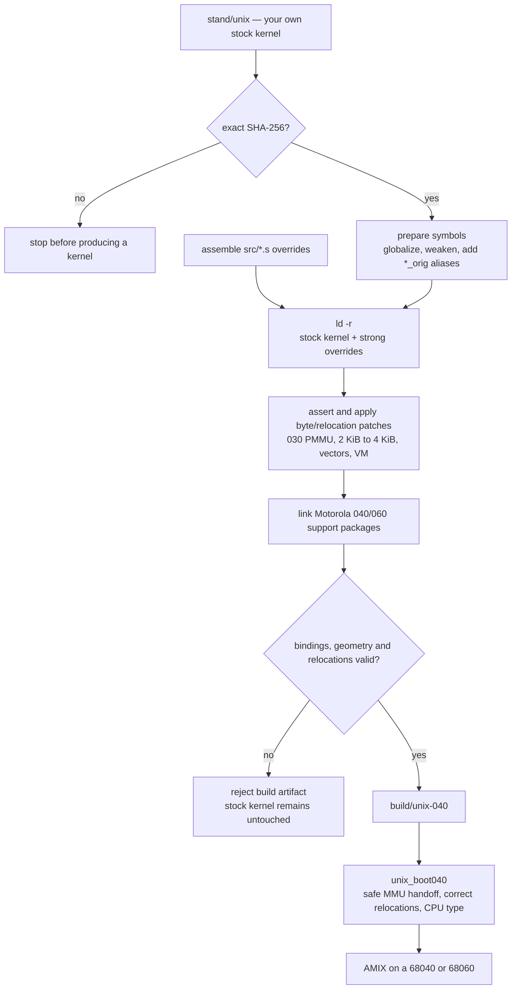

<p align="center">
  
</p>

# AMIX 68040/68060 Port

Amiga UNIX, commonly known as AMIX, is Commodore's port of AT&T System V Release 4 for the
Amiga 2500UX and 3000UX. Stock AMIX is notoriously picky about hardware: it expects a
complete 68020/68030 system with an MMU and FPU, and its stock driver set supports only a narrow
range of hardware.

There is little surviving evidence showing whether Commodore ever had an in-house 68040
development version. Maybe one day we will find out, but while waiting we can play around with
this toy.

This project continues my AI-assisted adventure into this obscure and commercially abandoned
operating system. It makes AMIX run on a **68040** and a **68060** by patching the stock kernel
binary rather than rebuilding it from a complete source tree, which is not publicly available.

You supply your own licensed AMIX 2.1c installation. This repository distributes neither the
stock nor a patched AMIX kernel image, and it does not contain the Commodore or AT&T source trees.

**This repository is not a kernel distribution. It is a patch and override layer for the kernel
you already own.**

```
   your AMIX install          this repository          what you boot
  ┌────────────────────┐    ┌───────────────┐    ┌────────────────────┐
  │  stand/unix        │───▶│ relink-040.sh │───▶│  unix-040          │
  │  68030 kernel      │    └───────────────┘    │  boots 040 and 060 │
  └────────────────────┘                         └────────────────────┘
      left untouched
```

## Foreword and disclaimer

This is hobbyist work on an early-1990s proprietary operating system. The motivation came from
an interest in using modern AI tools and curiosity about an old, obscure operating system. This
project is meant to be fun, not production infrastructure, so please treat it accordingly.

This repository is both a build system and a record of my AI-assisted work with Claude Code and
Codex. It deliberately keeps the errors, corrected conclusions, findings and history. It may not
be the smallest or neatest possible tree. As I myself am not an experienced developer nor do I 
decerve a true UNIX beard or have the deep understanding of the actual code, the intention therefore 
is to make the process visible and auditable. This approach should also support further examination
of this project with your own AI-asissistant.

This work is not affiliated with Commodore, AT&T, Amiga Corporation or anyone else. It is not
supported and not for production use. This is a technical exercise and a preservation project,
so please have fun.

For more concrete user information, visit the
[EAB forum thread](https://eab.abime.net/showthread.php?t=123245).

This project builds on groundwork by:

- Markus Wild - thank you for the `unix_boot` utility and its source code
- `isoriano1968` - the AMIX GCC cross-toolchain
- `jusii` and the wider AMIX community
- Commodore's original Amiga UNIX team


## What works

One kernel image boots both processors. Everything below has been done on a real Amiga 3000,
unless it says otherwise.

* **Boots to login** on a 68040 and on a 68060, and in Amiberry
* **Caches on** — instruction cache and data cache, in copyback mode, by default
* **X11R5 on real RTG hardware**, with two different cards and drivers: Xsvga on a Piccolo, and
  the Xrtg server on a Zorro II VA2000. The twm desktop works
* **Console and telnet login**, A2065 Ethernet
* **SCSI root filesystem**, `init`/`rc`, `fsck`, reboot and shutdown
* **NFS client**, read and write
* **Floating-point support is hardware-accepted** — Motorola's FPSP for the 68040 and the full
  68060 package, including all six enabled IEEE exception classes on 68060 hardware
* **The measured 68060 64-bit multiply forms used by the installed userland are emulated**;
  unrecognized forms take a counted fallback instead of being silently mis-executed
* **NetHack runs.** So does the native C compiler
* A memory leak that used to force a reboot every few hours is fixed

Every claim above has an acceptance document in `docs/` naming the build, platform, test and
result. A listed capability means measured coverage, not a claim that every possible input is proven.

### What works less well

* Long-term stability is better than it was, but unproven
* Two ways to crash it are known and captured, but not explained (`ISSUE-9`, `ISSUE-10`)
* `shutdown -i0` crashes on the halt path — the system survives it, and `reboot` works
* `init 6` hangs, but that one turned out to be userland (`rc6`), not the kernel
* The s5 filesystem is unsupported; its remaining 2 KiB/4 KiB problem is structural rather than
  merely untested
* Booting needs the patched `unix_boot040` loader; the native boot-partition path is still
  68030-only
* Zorro III is not available yet — see below
* 68LC060 is unsupported and untested; the FPU-absent initialization path is not implemented

### Next

* Zorro III RTG cards
* Reconstructing the kernel sources from the SVR4 3B2 tree — maybe?

## Where it runs

**Real hardware.** An Amiga 3000 with a 68040 or 68060 accelerator. Tested on a Mercury with both
a 68040 and a 68060 fitted, and on an A3640 — three configurations, because the A3640 has no RAM
of its own and the kernel ends up in a different place in memory. On a 68060, run **SetPatch**
before booting; it is a precondition, not a tweak.

**Emulators.** It also boots under UAE, and most of the development happened there — principally
**Amiberry**, on both emulated CPUs. You can try the whole thing without an accelerator card. Two
things the emulator cannot do, so a few paths are only ever exercised on real silicon: it raises
no enabled IEEE floating-point exceptions, and it never produces a 68040 write-back in the first
slot.

You also need:

* the patched loader **`unix_boot040`** from the companion project `amix-unix-boot` — the stock
  loader cannot start a kernel on anything newer than a 68030
* your own AMIX SVR4 2.1c installation

## What you need before you can build

The build runs on Linux. Nothing here is downloaded for you, and two of these take real time to
set up, so it is worth reading this list before starting.

| | | Where |
|---|---|---|
| **AMIX cross compiler** | `m68k-cbm-sysv4-gcc` and `m68k-cbm-sysv4-ld`; build this first | [gcc-cross-amix](https://github.com/isoriano1968/gcc-cross-amix) |
| **GNU m68k tools** | for symbol surgery and the ELF checks | on Debian `apt install binutils-m68k-linux-gnu gcc-m68k-linux-gnu` |
| **Your AMIX 2.1c full installation** | mounted or unpacked somewhere readable — the build needs the vanilla kernel file `stand/unix` from it | your own disk or disk image |
| **A NetBSD source tarball** | Motorola's floating-point packages are taken out of it at build time; they are not shipped here | any recent `syssrc.tgz` |
| Python 3, `patch`, coreutils | | your distribution |

Two things that trip people up when building the cross compiler: set `AMIX_ROOT` explicitly
because its own default is unhelpful, and skip the AMIX `usr/lib` directory, which is usually
root-owned and unreadable from a mounted image:

```sh
make all AMIX_ROOT=/path/to/your/amix AMIX_USR_LIB=/nonexistent
```

You do not have to guess whether you got it all: `tools/check-env.sh` checks every item above,
says which one is missing and where to get it, and verifies that your `stand/unix` is the kernel
this port was measured against.

The build scripts are POSIX `sh` and `awk` on purpose — no bash, no gawk — so a plain Debian or
Ubuntu install is enough.

## Quick start

```sh
cp config.sh.example config.sh    # tell it where your toolchains and your AMIX install are
$EDITOR config.sh                 # every variable is documented in the file
sh tools/check-env.sh             # checks every dependency and your kernel's SHA-256
sh relink-040.sh                  # -> build/unix-040
```

Then on the Amiga, having copied the image to your AmigaOS volume:

```
unix_boot040 unix-040
```

Full instructions and the toolchains: **[`BUILDING.md`](BUILDING.md)**.

## How it works

The build uses two primary mechanisms. Whole routines — MMU and cache handling, fault paths and
floating-point glue — are **replaced** by exposing selected stock symbols, weakening their original
definitions and linking stronger implementations over them. The original body can remain reachable
through a `*_orig` alias when an override still needs part of the stock behavior.

Smaller changes are asserted **edits in place**: instructions, shift counts, page-size constants,
relocation targets and vector entries. The build rejects an unexpected input or patch site.



The loader-provided CPU type is why one image serves both processors: every CPU-specific path
checks that value at runtime. The patched loader is also mandatory because it avoids the stock
loader's 68030-only MMU shutdown and applies the PC-relative relocations used by the support
packages correctly.

## If it does not boot

The build never modifies the source `stand/unix`; it works on a copy under `build/`. Booting an
experimental kernel is different: a kernel defect can still panic the machine or damage a mounted,
writable filesystem.

Keep backups and retain a known-good kernel and boot path. If the new image does not start, boot
the original AMIX kernel with a 68030-capable configuration; do not overwrite your only known-good
image with the relinked one.

To find out *why*, build a debug kernel instead and watch it over a serial line:

```sh
sh relink-040-dbg.sh      # base kernel + probes
sh relink-040-quiet.sh    # base kernel + console mirrored to serial
```

On real hardware that is a serial-to-USB adapter on the A3000's serial port; under Amiberry it is
a TCP port in the configuration. The loader also prints to serial, so one capture holds the
loader's output and the kernel's on the same timeline. This is usually enough to see how far it
got.

## Some things people ask about

### "AMIX can only see 16 MB"

The evidence does not support a 16 MB kernel ceiling. A 32 MB accelerator-memory region has booted
and passed sustained hardware stress tests on both CPUs. That proves more than 16 MB works; it does
not prove that every larger or fragmented memory configuration works.

- **Kernel ceiling?** No 16 MB ceiling has been observed in static analysis or hardware tests.
- **A3000 motherboard ceiling?** Yes: the standard motherboard provides at most 16 MB of Fast RAM.
- **Must memory be contiguous?** The current boot path selects one contiguous non-chip region and
  does not combine the separate 32 MB accelerator and 16 MB motherboard regions.
- **Does 32 MB accelerator RAM cause trouble?** Not in the tested Mercury configurations; it has
  passed the project's hardware acceptance and stress workloads.
- **What about older SCSI controllers?** A2090/A2091 have their own DMA-address and bounce-buffer
  constraints, but they were not part of this port's hardware acceptance and are not a kernel
  RAM limit.

On an **A3640** the accelerator has no RAM of its own, so the kernel runs from the A3000
motherboard's Fast RAM, whose standard maximum is 16 MB before the kernel and other reservations.
That is a property of the hardware configuration, not an AMIX 16 MB ceiling. With a Mercury, the
loader instead places the same kernel in the accelerator's larger local-memory region.

What *is* a real limitation, and was measured here: this machine offers **48 MB in two separate
regions** — 32 MB at `0x08000000` and another 16 MB at `0x07000000`, the second one *below* the
first — and the current boot/kernel path counts only the region containing the kernel. The other
16 MB is therefore left unused because of the region-selection algorithm, not a 16 MB ceiling.

### Zorro III

The current port does not yet provide a supported kernel mapping for high-address Zorro III
device apertures. The loader can record Zorro III AutoConfig entries, but recognizing a card is
different from safely mapping its MMIO and framebuffer with the correct cache policy.

There seems to be for example at least one Zorro III only hardware existed (the [Ameristar
1600GX](https://bigbookofamigahardware.com/bboah/product.aspx?id=474)). Therefore the claim
that "AMIX does not support Zorro III" might be too broad. Modern Zorro III RTG support is the
next substantial feature being considered here.

### Is it possible to compile the Amiga UNIX kernel from source?

Not from the files currently available as a complete, original source tree.

The AMIX installation includes substantial source code, but many generic kernel subsystems and
some machine-dependent components are present only as relocatable `exp` objects. Available SVR4
3B2 sources are a valuable reference for much of the generic code, but they are not a drop-in AMIX
source tree. The remaining work includes both adapting that generic code to the measured AMIX ABI
and reconstructing machine-specific pieces for which no equivalent source is available.

In principle those modules can be replaced incrementally until a source-buildable kernel exists.
That is a separate and much larger project, not the goal of this binary port.


## Files

| path | what |
|---|---|
| `relink-040.sh` | the build: assembles the replacements, links them in, applies the byte patches, validates |
| `relink-040-*.sh` | variants: debug probes, serial mirror, and the RTG graphics kernels |
| `src/*.s` | replacement routines, wrappers, support-package glue and diagnostic probes — see [`src/README.md`](src/README.md) |
| `src/patch_*.py` | the in-place edits, one script per group of changes |
| `tools/` | environment check, kernel verification, and the script that generates the live counter addresses |
| `test-tools/` | the test programs used for acceptance on hardware |
| `docs/` | acceptance records and analysis — the evidence behind the table above |
| `STATUS.md` | what is proven, on which machine, with links to the evidence |
| `KNOWN-ISSUES.md` | every defect found, in order |

## Documentation

* **[`STATUS.md`](STATUS.md)** — the canonical picture. Where any other document disagrees with
  it, this one is right and the other is history.
* **[`BUILDING.md`](BUILDING.md)** — dependencies, build, verification, and how the port works.
* **[`KNOWN-ISSUES.md`](KNOWN-ISSUES.md)** — every defect found, including the ones that turned
  out not to be defects.
* **[`docs/METHOD.md`](docs/METHOD.md)** — how the work was done, and an honest account of what
  the AI assistance did and did not do.
* **[`docs/contracts/INDEX.md`](docs/contracts/INDEX.md)** — the static contracts the code is
  written against.

The record keeps the failures on purpose: expectations that did not happen, fixes reverted within
the hour, a clock figure that was wrong for months. A reader who cannot see the wrong turns cannot
judge the right ones.

## Related projects

| Repository | What |
|---|---|
| `amix-unix-boot` | the patched AmigaOS bootstrap — **required** to boot anything built here |
| `va2000-amix` | MNT VA2000 RTG driver |
| `xrtg-amix` | Xsvga / X11 for Piccolo and Picasso II |
| [`gcc-cross-amix`](https://github.com/isoriano1968/gcc-cross-amix) | the `m68k-cbm-sysv4` cross toolchain this build needs |


## License

New code and modifications: **MIT** — see `LICENSE`.

**No AMIX kernel binary and no Commodore or AT&T source tree is distributed here.** That is not
the same as "no third-party text at all", and `NOTICE` is precise about the exception: eleven
one-line page-geometry macros in `include-modelb/`, identical to the vendor's because they are the
kernel's compile-time ABI and there is no other way to write them that still interoperates.
`tools/check-verbatim.py` reports them on every run rather than letting them pass unmentioned.

The Motorola 68040/68060 support packages are fetched from a NetBSD source tarball at build time
and keep their own terms; their notices are reproduced unaltered in `THIRD_PARTY_NOTICES/`. Some
algorithms are derived from NetBSD's m68k support, which is BSD-licensed. See `NOTICE`.

-Antti Sokero 2026
